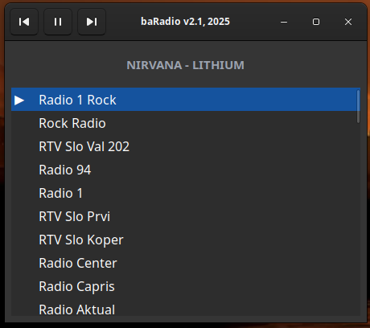
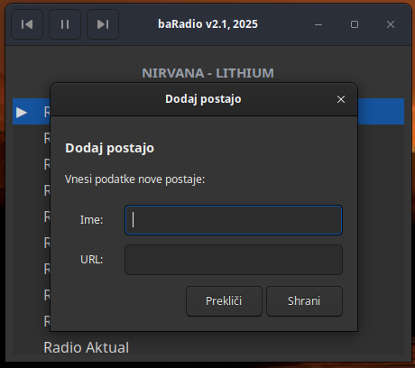
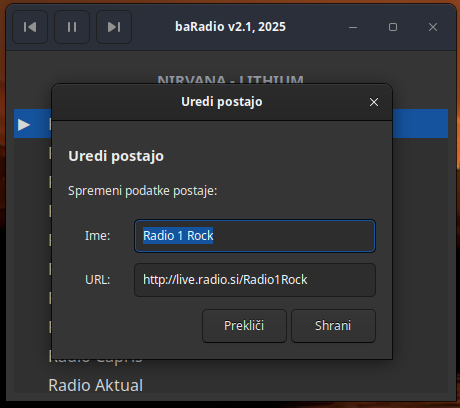
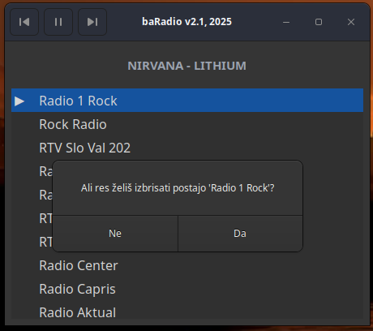
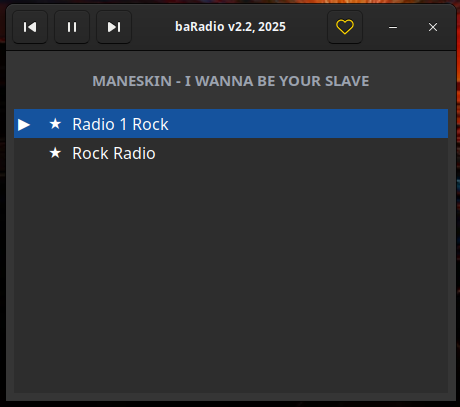

baRadio
=======

Preprost GTK3 radijski predvajalnik.

## Funkcionalnost
- Predvajanje spletnih radijskih postaj
- Upravljanje seznama postaj (dodajanje, urejanje, brisanje)
- Prikaz trenutne skladbe (če jo postaja oddaja)
- Tray ikona z osnovnimi kontrolami
- Podpora za multimedijske tipke (play/pause, stop, next, previous)
- MPRIS D-Bus integracija za sistemske medijske kontrole
- Iskanje postaj po imenu
- Shranjevanje zadnje predvajane postaje

## Zahteve za uporabo

Programu za delovanje potrebujete naslednje knjižnice:

- **GTK 3** - grafični vmesnik
- **GStreamer 1.0** - predvajanje avdio tokov
- **SQLite 3** - baza podatkov za postaje
- **Ayatana AppIndicator 3** - tray ikona

### Namestitev odvisnosti po distribucijah

**Ubuntu/Debian/Mint:**
```sh
sudo apt install libgtk-3-0 libayatana-appindicator3-1 libsqlite3-0 gstreamer1.0-plugins-base gstreamer1.0-plugins-good gstreamer1.0-plugins-bad
```

**Fedora/RHEL/CentOS:**
```sh
sudo dnf install gtk3 libayatana-appindicator-gtk3 sqlite gstreamer1-plugins-base gstreamer1-plugins-good gstreamer1-plugins-bad-free
```

**Arch Linux/Manjaro:**
```sh
sudo pacman -S gtk3 libayatana-appindicator sqlite gstreamer gst-plugins-base gst-plugins-good gst-plugins-bad
```

**Solus (runtime):**
```sh
sudo eopkg install libgtk-3 libayatana-appindicator sqlite3 gstreamer-1.0-plugins-base gstreamer-1.0-plugins-good gstreamer-1.0-plugins-bad
```

## Zahteve za razvoj

Za kompilacijo programa iz izvorne kode potrebujete orodja in razvojne knjižnice:

**Ubuntu/Debian/Mint:**
```sh
sudo apt install build-essential pkg-config libgtk-3-dev libayatana-appindicator3-dev libsqlite3-dev libgstreamer1.0-dev
```

**Fedora/RHEL/CentOS:**
```sh
sudo dnf install gcc make pkg-config gtk3-devel libayatana-appindicator-gtk3-devel sqlite-devel gstreamer1-devel
```

**Arch Linux/Manjaro:**
```sh
sudo pacman -S base-devel pkg-config gtk3 libayatana-appindicator sqlite gstreamer
```

**Solus (build deps):**
```sh
sudo eopkg install -c system.devel libgtk-3-devel libayatana-appindicator-devel sqlite3-devel gstreamer-1.0-devel gstreamer-1.0-plugins-base-devel
```

Na Solusu lahko uporabite priloženo skripto `scripts/install-deps-solus.sh` za namestitev runtime in razvojnih paketov.

## Gradnja

Za prevajanje projekta iz izvora:

```sh
make
```

## Namestitev

```sh
sudo make install
```

Program se namesti v `/usr/local/bin/`, ikona v `/usr/local/share/icons/hicolor/scalable/apps/` in `.desktop` datoteka v `/usr/local/share/applications/`.

## Odstranitev

```sh
sudo make uninstall
```

## Zagon

```sh
./baradio
```

Ali po namestitvi poiščite "baRadio" v aplikacijskem meniju.

## Uporaba

- Desni klik na seznam postaj za dodajanje, urejanje ali brisanje postaj
- Dvojni klik na postajo za predvajanje
- Tipkanje v seznamu postaj odpre iskalno polje
- ESC zapre iskalno polje
- Multimedijske tipke za kontrolo predvajanja

## Baza podatkov

Postaje in nastavitve so shranjene v SQLite bazi: `~/.config/baradio/baradio.db`

## Opombe

- Ikona za tray mora biti na voljo v sistemski temi ikon pod imenom `radio`
- Program podpira samo en tekoči primerek (single instance)
- Za predvajanje nekaterih formatov lahko potrebujete dodatne GStreamer vtičnike

## Slike

Spodaj so prikazi aplikacije, ki predstavljajo osnovni izgled vmesnika.

<div style="display:flex; flex-direction:column; gap:12px; align-items:center; justify-content:center;">
  
  
  
  
  
  
</div>


## Avtor

BArko & SimOne, 2025 
